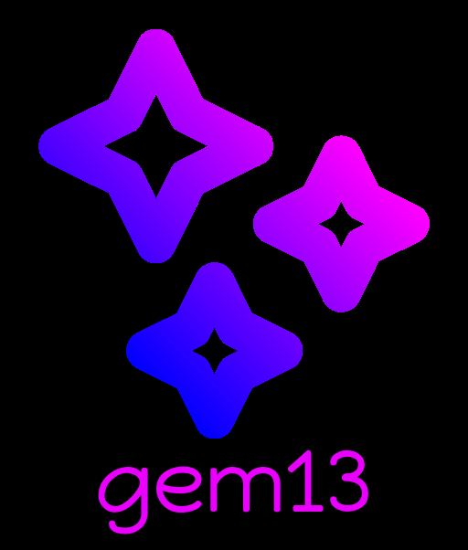

# Gem13 AI
# That is neural network for C++ programmers

## Neural network can analyze code and refactor it. You can train it with your own code samples so that the neural network is precisely customized for you and your code peculiarities. For this purpose, there is a graphical interface so that the neural network can be used by novice programmers or those who do not know Python. 
### Perhaps in the future languages such as Python and Go will be supported. As development progresses, I will supplement this file with examples, function descriptions. You can always download the latest versions of the model and tokenizer in the Release section and use them in your projects.